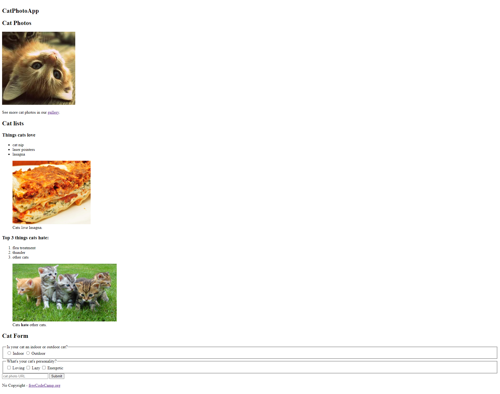

# Cat Photo app

## Description

In this app I built my first web application using HTML. The application presents a title, a picture with a cat, an orderendered and unordered list, and a form with radion and checkbox buttons. The form also contains a submit button.

## Technologies used

- HTML5

## Link to the application

Click [here](https://liana-valeria.github.io/cat_photo_app/) to view the live application.

## Screenshot

